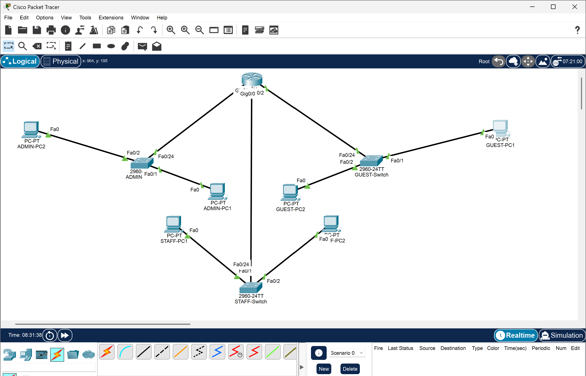
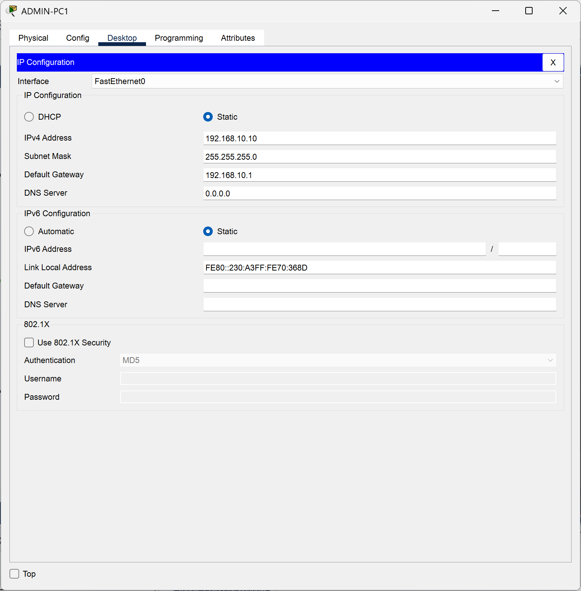
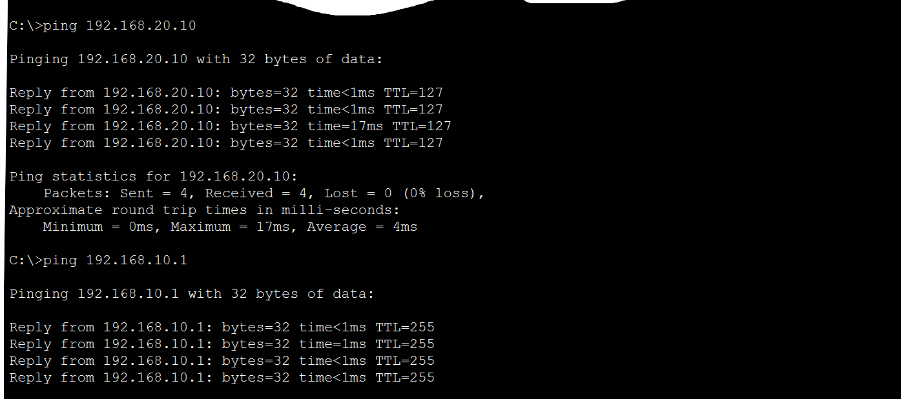
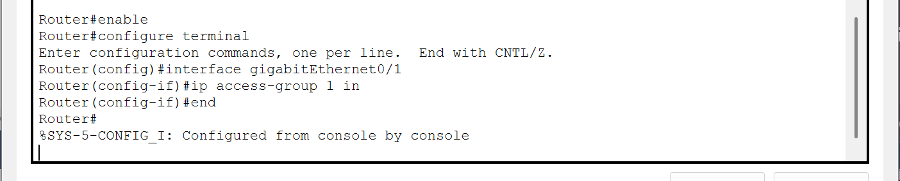
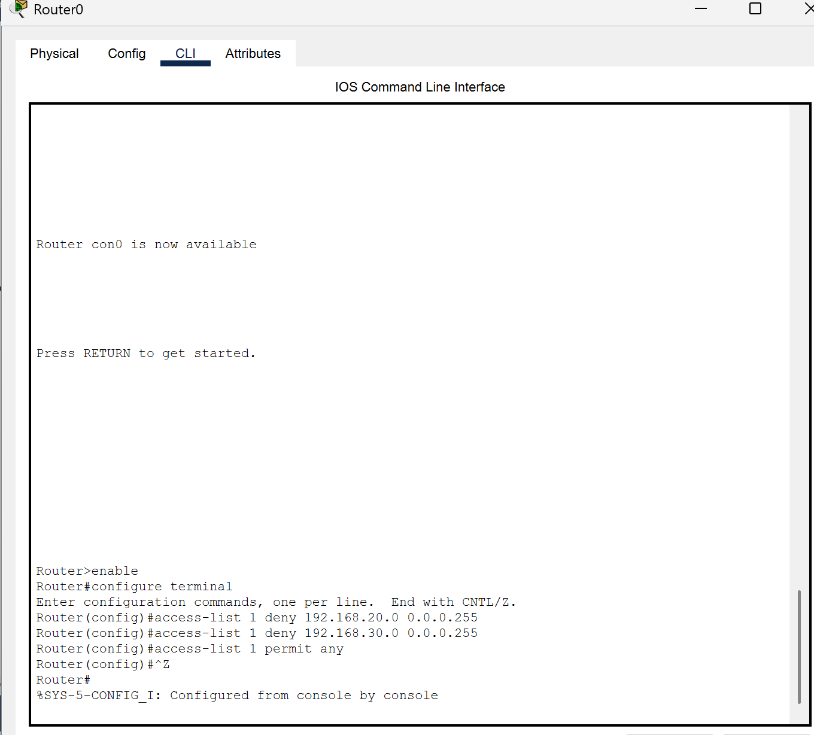
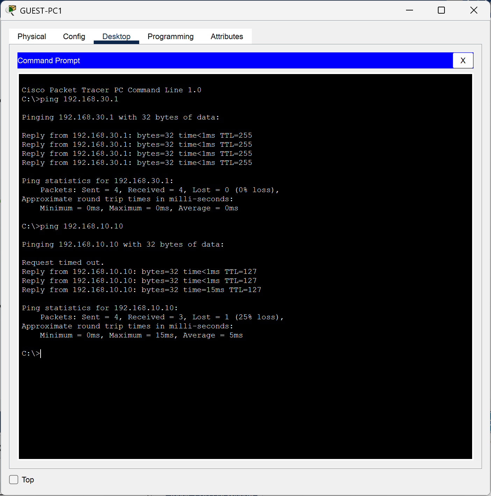

Designing and Securing a Virtual Enterprise Network

This project demonstrates the design of a simple virtual enterprise network using Cisco Packet Tracer, with a focus on controlling inter-department traffic using Access Control Lists (ACLs). The goal of this lab was to understand how routing and basic network security work together in a practical, hands-on environment.

Project Overview

The objective of this project was to:
- Design a small enterprise-style network
- Verify normal connectivity between networks
- Apply security controls using ACLs
- Observe and analyze how traffic is allowed or denied

The network was divided into three logical groups:
- **Admin Network**
- **Staff Network**
- **Guest Network**

•	Network Topology

The network consists of multiple PCs connected through switches and a router that provides inter-network communication.

Figure 1: Virtual enterprise network topology showing Admin, Staff, and Guest networks.

•	IP Address Configuration

Each PC was assigned a static IP address to ensure proper communication across the network.

Admin PC Configuration
- IP Address: `192.168.10.10`
- Subnet Mask: `255.255.255.0`
- Default Gateway: `192.168.10.1`

Figure 2: Static IP configuration for the Admin PC.

•	Connectivity Test (Before Applying ACL)

Before implementing any security controls, connectivity was tested to confirm that routing was functioning correctly.

- Admin PC successfully pinged Staff PC
- Guest PC was able to reach the Admin PC

*Figure 3: Successful connectivity test before applying ACLs.*

This confirmed that all networks could communicate freely before restrictions were applied.

•	Access Control List (ACL) Configuration

To secure the Admin network, a standard ACL was created on the router. The ACL was designed to:
- Deny traffic from the Staff network
- Deny traffic from the Guest network
- Allow all other traffic

The ACL was configured in global configuration mode and then applied **inbound** on the appropriate router interface.

Figure 4: ACL applied inbound on the router interface to enforce traffic restrictions.

Figure 5: Router CLI showing ACL rules configured with deny and permit statements.

These two steps are both required, creating an ACL alone does not enforce security unless it is applied to an interface.

•	Connectivity Test (After Applying ACL)
- Guest Network → Admin Network
After the ACL was applied, connectivity tests were repeated. When the Guest PC attempted to ping the Admin PC, most packets were blocked.

Figure 5: Guest network traffic being restricted after ACL enforcement.

Note: One packet was delivered while others failed. This behavior can occur due to address resolution or packets already in transit before the ACL fully takes effect. Subsequent tests confirmed that access was successfully blocked.

- Staff Network → Admin Network

The Staff PC was also unable to reach the Admin PC after the ACL was enforced.

Figure 6: Staff network unable to reach the Admin network after ACL application.

This confirms that the security policy was successfully implemented.

•	Challenges Faced and Lessons Learned

During this project, several challenges were encountered:
- Receiving `Invalid input detected` errors due to entering commands in the wrong configuration mode
- Creating an ACL without applying it to an interface, which initially allowed traffic to continue
- Confusion caused by partial ping success before ACL enforcement stabilized

These challenges helped reinforce the importance of understanding **where** and **how** security rules are applied.

•	Key Takeaways

- ACLs do not work unless they are applied to an interface
- The direction (inbound or outbound) of an ACL matters
- Connectivity should always be tested before and after applying security controls
- Troubleshooting is a critical part of network engineering

•	Possible Improvements
Future enhancements to this project could include:
- VLAN segmentation
- Extended ACLs
- Inter-VLAN routing
- NAT configuration

Tools Used: Cisco Packet Tracer  
Focus Area: Networking & Basic Security  
**Project Type:** Hands-on lab
